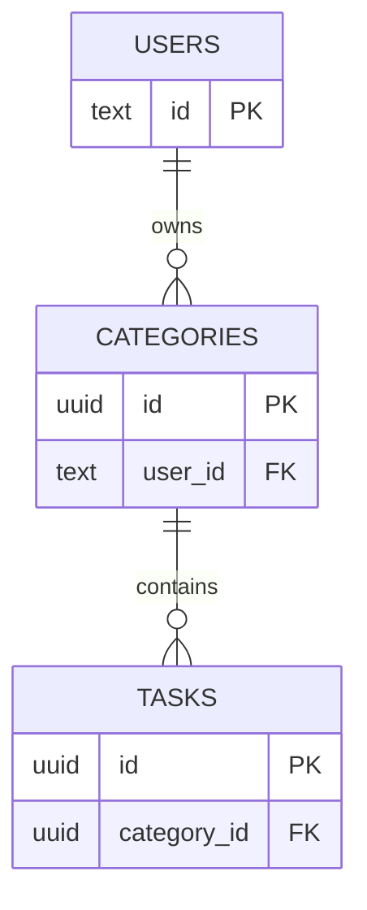

# SortNote

## 概要

SortNote は、ドラッグ&ドロップで直感的にタスクを整理できるモダンなタスク管理アプリケーションです。カテゴリー別にタスクを管理し、Google アカウントでログインすることでクラウドに自動保存されます。モバイルとデスクトップの両方に対応したレスポンシブデザインで、どこからでもタスク管理が可能です。

## 技術スタック

### フロントエンド
- **Next.js 15** - App Router を使用した React フレームワーク
- **TypeScript 5** - 型安全な開発
- **React 19** - 最新の React 機能を活用
- **SCSS (Sass)** - スタイリング
- **Framer Motion** - スムーズなアニメーション
- **@dnd-kit** - ドラッグ&ドロップ機能

### バックエンド
- **Supabase** - データベースとリアルタイム同期
- **NextAuth.js** - Google OAuth 認証

### 開発ツール
- **ESLint** - コード品質管理
- **Turbopack** - 高速な開発ビルド

## アーキテクチャ

### Feature-Based 設計

プロジェクトは機能ベースで構造化され、保守性と拡張性を重視しています：

```
src/
├── app/                    # Next.js App Router
│   ├── api/               # API Routes
│   │   ├── auth/         # NextAuth エンドポイント
│   │   └── data/         # データ同期 API
│   │       ├── route.ts  # GET / POST ハンドラー
│   │       └── helpers.ts # DB同期ヘルパー関数
│   ├── login/            # ログインページ
│   └── page.tsx          # メインページ
├── components/            # React コンポーネント
│   ├── notes/            # Notes 機能の UI コンポーネント
│   │   ├── NotesHeader.tsx
│   │   ├── NotesSidebar.tsx
│   │   ├── NotesList.tsx
│   │   ├── NotesLoadingState.tsx
│   │   └── MobileCategoryNav.tsx
│   ├── App.tsx           # メインアプリケーション
│   ├── SortableCategory.tsx
│   ├── SortableTask.tsx
│   └── SessionProvider.tsx
├── hooks/                 # カスタムフック（関心の分離）
│   ├── notes/
│   │   ├── useNotesApi.tsx    # API 通信ロジック
│   │   ├── useNotesData.tsx   # データ状態管理
│   │   ├── useNotesDnd.tsx    # ドラッグ&ドロップ
│   │   └── useNotesUI.tsx     # UI 状態管理
│   ├── useNotes.tsx       # 統合フック
│   └── useNotesSync.tsx   # データ同期
├── lib/                   # ユーティリティ
│   └── supabase-server.ts
├── types/                 # 型定義
│   ├── notes.ts           # フロント共通の型
│   ├── api.ts             # APIペイロードの型
│   └── next-auth.d.ts
└── styles/               # グローバルスタイル
    └── App.module.scss
```

### 設計の特徴

- **関心の分離**: カスタムフックを機能別に分割（API、データ、DnD、UI）
- **コンポーネント分離**: 再利用可能な小さなコンポーネントに分割
- **型安全性**: TypeScript による厳格な型チェック
- **レスポンシブ対応**: モバイルとデスクトップで最適化された UI
- **クライアント側 ID 発行**: `crypto.randomUUID()` でクライアントが ID を生成し、サーバーへの往復を削減
- **DB ベースの同期**: upsert + DB 側 NOT IN 削除で差分計算をサーバーに委譲。`ON DELETE CASCADE` によりカテゴリー削除時のタスク削除も自動処理

## データベース設計



## 主な機能

### 認証・データ管理
- **Google ログイン認証** - NextAuth.js による安全な認証
- **自動データ同期** - Supabase によるリアルタイム保存とロード
- **初回ロード制御** - データロード完了まで入力を禁止し、データ消失を防止

### タスク管理
- **カテゴリー管理** - タスクをカテゴリー別に整理
- **ドラッグ&ドロップ** - カテゴリーとタスクの直感的な並べ替え
- **カテゴリー間移動** - タスクを別のカテゴリーにドラッグで移動
- **タスク完了管理** - 完了・未完了の切り替え
- **カテゴリー折りたたみ** - 表示を整理してスッキリ管理

### UI/UX
- **レスポンシブデザイン** - モバイル・タブレット・デスクトップ対応
- **テーマカラー切り替え** - 2 つのカラーテーマから選択可能
- **モバイル最適化** - スワイプナビゲーションとタッチ操作に対応
- **スムーズなアニメーション** - Framer Motion による快適な操作感

## はじめに

開発サーバーを起動してください：

```bash
npm run dev
# または
yarn dev
# または
pnpm dev
# または
bun dev
```

ブラウザで [http://localhost:3000](http://localhost:3000) を開くとアプリが表示されます。

## 機能

- Google ログイン認証
- カテゴリーとタスクのドラッグ&ドロップ並べ替え
- タスクのカテゴリー間ドラッグ移動
- カテゴリーの折りたたみ
- タスクの完了・未完了切り替え
- モバイル対応レスポンシブデザイン
- テーマカラー切り替え
- Supabase による自動データ同期（サインイン時の自動ロード、編集時の自動保存）

## Supabase セットアップ（開発環境）

このアプリはカテゴリーとタスクを Supabase に保存します。データの永続化を有効にするには：

1. Supabase プロジェクトの SQL エディタで `supabase-schema.sql`（リポジトリルートにあります）を実行して、`categories` と `tasks` テーブルと RLS ポリシーを作成してください。

2. `.env.local` ファイルに以下の環境変数を追加してください（秘密情報はコミットしないでください）：

```
NEXT_PUBLIC_SUPABASE_URL=your-supabase-url
NEXT_PUBLIC_SUPABASE_ANON_KEY=your-anon-key
SUPABASE_SERVICE_ROLE_KEY=your-service-role-key

# NextAuth 設定（Google）
NEXTAUTH_URL=http://localhost:3000
NEXTAUTH_SECRET=some_long_random_secret
GOOGLE_CLIENT_ID=...
GOOGLE_CLIENT_SECRET=...
```

3. 開発サーバーを起動してサインインしてください。カテゴリーやタスクの編集は自動的に保存され、サインイン時に既存データが自動でロードされます。

## デプロイ

Next.js アプリをデプロイする最も簡単な方法は、Next.js の作成者による [Vercel プラットフォーム](https://vercel.com/new?utm_medium=default-template&filter=next.js&utm_source=create-next-app&utm_campaign=create-next-app-readme) を使用することです。

詳細については [Next.js デプロイメント ドキュメント](https://nextjs.org/docs/app/building-your-application/deploying) をご覧ください。
