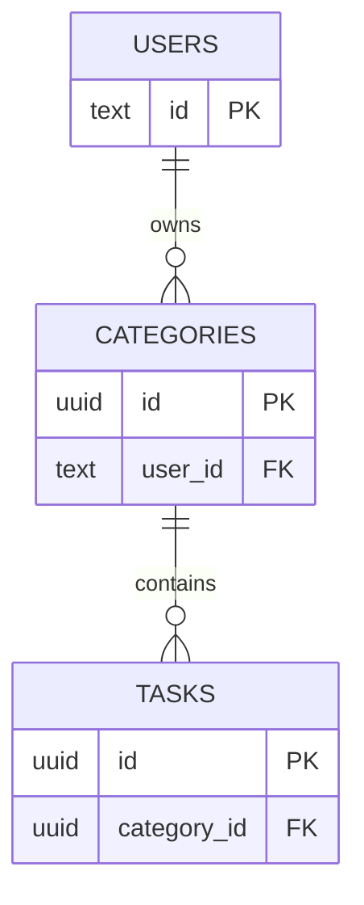

# SortNote

## 概要

SortNote は、ドラッグ&ドロップで直感的にタスクを整理できるモダンなタスク管理アプリケーションです。カテゴリー別にタスクを管理し、Google アカウントでログインすることでクラウドに自動保存されます。モバイルとデスクトップの両方に対応したレスポンシブデザインで、どこからでもタスク管理が可能です。

## 技術スタック

### フロントエンド
- **Next.js 15** - App Router を使用した React フレームワーク
- **TypeScript 5** - 型安全な開発
- **React 19** - 最新の React 機能を活用
- **SCSS (Sass)** - スタイリング
- **@dnd-kit** - ドラッグ&ドロップ機能

### バックエンド
- **Supabase** - データベースとリアルタイム同期
- **NextAuth.js** - Google OAuth 認証

### 開発ツール
- **ESLint** - コード品質管理
- **Turbopack** - 高速な開発ビルド

## アーキテクチャ

### ディレクトリ構成

プロジェクトは基本的に **レイヤーベース（layer-based）** で構成されています。`components/`・`hooks/`・`lib/`・`types/` といったレイヤーごとにディレクトリを分け、各レイヤーの内部では notes のように機能（feature）単位でサブディレクトリにグルーピングしています：

```
src/
├── app/                    # Next.js App Router
│   ├── api/               # API Routes
│   │   ├── auth/         # NextAuth エンドポイント
│   │   ├── categories/   # カテゴリー CRUD API
│   │   │   ├── route.ts          # POST（作成）
│   │   │   ├── [id]/route.ts     # PATCH（更新）/ DELETE（削除）
│   │   │   └── reorder/route.ts  # PATCH（並び順更新）
│   │   ├── tasks/        # タスク CRUD API
│   │   │   ├── route.ts          # POST（作成）
│   │   │   ├── [id]/route.ts     # PATCH（更新）/ DELETE（削除）
│   │   │   └── reorder/route.ts  # PATCH（並び順更新）
│   │   └── notes/        # 初回ロード API
│   │       └── route.ts  # GET（全データ一括取得）
│   ├── login/            # ログインページ
│   └── page.tsx          # メインページ
├── components/            # React コンポーネント
│   ├── notes/            # Notes 機能の UI コンポーネント
│   │   ├── NotesHeader.tsx
│   │   ├── NotesSidebar.tsx
│   │   ├── NotesList.tsx
│   │   ├── NotesLoadingState.tsx
│   │   └── MobileCategoryNav.tsx
│   ├── App.tsx           # メインアプリケーション
│   ├── SortableCategory.tsx
│   ├── SortableTask.tsx
│   └── SessionProvider.tsx
├── hooks/                 # カスタムフック
│   ├── notes/
│   │   ├── useNotesApi.tsx    # API 通信ロジック
│   │   ├── useNotesData.tsx   # データ状態管理
│   │   ├── useNotesDnd.tsx    # ドラッグ&ドロップ
│   │   └── useNotesUI.tsx     # UI 状態管理
│   ├── useNotes.tsx       # 統合フック
│   └── useNotesSync.tsx   # データ同期
├── lib/                   # ユーティリティ
│   ├── supabase-server.ts
│   ├── api-helpers.ts     # requireAuth（認証ヘルパー）
│   └── db-helpers.ts      # composeMemos（DB→フロント変換）
├── types/                 # 型定義
│   ├── notes.ts           # フロント共通の型
│   ├── api.ts             # APIペイロードの型
│   └── next-auth.d.ts
└── styles/               # グローバルスタイル
    └── App.module.scss
```

### 設計の特徴

- **関心の分離**: カスタムフックを機能別に分割（API、データ、DnD、UI）
- **コンポーネント分離**: 再利用可能な小さなコンポーネントに分割
- **型安全性**: TypeScript による型チェック
- **レスポンシブ対応**: モバイルとデスクトップに対応
- **DBが真**: IDはDBが発行。操作はAPIレスポンスでstateを更新し、失敗時はstateを変更しない
- **操作単位のAPI**: カテゴリー・タスクごとに粒度別エンドポイントを使用

## データベース設計



## 主な機能

### 認証・データ管理
- **Google ログイン認証** - NextAuth.js による認証
- **DB中心の状態管理** - IDはDBが発行。書き込み成功後にDBレスポンスでstateを更新
- **初回ロード制御** - データロード完了まで入力を制限

### タスク管理
- **カテゴリー管理** - タスクをカテゴリー別に整理
- **ドラッグ&ドロップ** - カテゴリーとタスクの直感的な並べ替え
- **カテゴリー間移動** - タスクを別のカテゴリーにドラッグで移動
- **タスク完了管理** - 完了・未完了の切り替え
- **カテゴリー折りたたみ** - 表示を整理してスッキリ管理

### UI/UX
- **レスポンシブデザイン** - モバイル・デスクトップ対応
- **テーマカラー切り替え** - 2 つのカラーテーマから選択可能

## はじめに

開発サーバーを起動してください：

```bash
npm run dev
# または
yarn dev
# または
pnpm dev
# または
bun dev
```

ブラウザで [http://localhost:3000](http://localhost:3000) を開くとアプリが表示されます。

## 機能

- Google ログイン認証
- カテゴリーとタスクのドラッグ&ドロップ並べ替え
- タスクのカテゴリー間ドラッグ移動
- カテゴリーの折りたたみ
- タスクの完了・未完了切り替え
- モバイル対応レスポンシブデザイン
- テーマカラー切り替え
- Supabase によるデータ同期（サインイン時のロード、操作単位の自動保存）

## Supabase セットアップ（開発環境）

このアプリはカテゴリーとタスクを Supabase に保存します。データの永続化を有効にするには：

1. Supabase プロジェクトの SQL エディタで `supabase-schema.sql`（リポジトリルートにあります）を実行して、`categories` と `tasks` テーブルと RLS ポリシーを作成してください。

2. `.env.local` ファイルに以下の環境変数を追加してください（秘密情報はコミットしないでください）：

```
NEXT_PUBLIC_SUPABASE_URL=your-supabase-url
NEXT_PUBLIC_SUPABASE_ANON_KEY=your-anon-key
SUPABASE_SERVICE_ROLE_KEY=your-service-role-key

# NextAuth 設定（Google）
NEXTAUTH_URL=http://localhost:3000
NEXTAUTH_SECRET=some_long_random_secret
GOOGLE_CLIENT_ID=...
GOOGLE_CLIENT_SECRET=...
```

3. 開発サーバーを起動してサインインしてください。カテゴリーやタスクの編集は自動的に保存され、サインイン時に既存データが自動でロードされます。

## デプロイ

Next.js アプリをデプロイする最も簡単な方法は、Next.js の作成者による [Vercel プラットフォーム](https://vercel.com/new?utm_medium=default-template&filter=next.js&utm_source=create-next-app&utm_campaign=create-next-app-readme) を使用することです。

詳細については [Next.js デプロイメント ドキュメント](https://nextjs.org/docs/app/building-your-application/deploying) をご覧ください。
